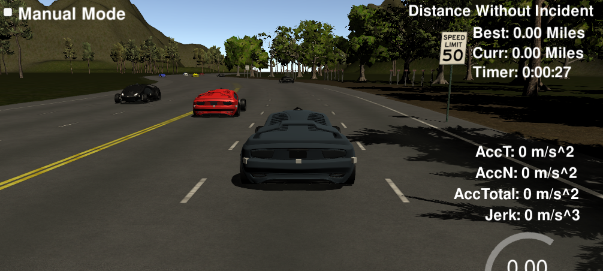
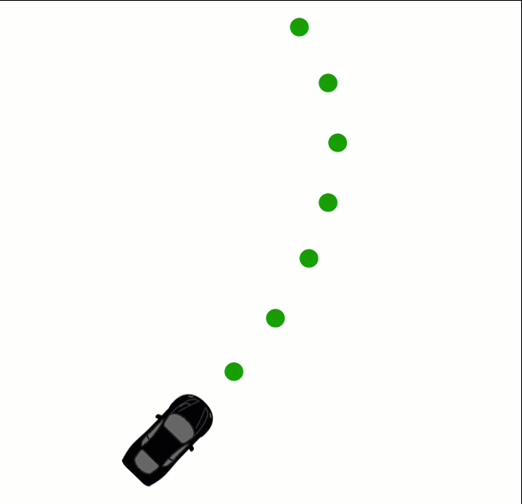

<!-- 
***************************************************************************
https://review.udacity.com/#!/rubrics/1971/view
2. Localization, Path Planning, Control, and System Integration
Project Specification
CarND-P7-Path_Planning

Compilation
    1 - The code compiles correctly: Code must compile without errors with cmake and make. Given that we've made CMakeLists.txt as general as possible, it's recommend that you do not change it unless you can guarantee that your changes will still compile on any platform.

Valid Trajectories 
    2 - The car is able to drive at least 4.32 miles without incident: The top right screen of the simulator shows the current/best miles driven without incident. Incidents include exceeding acceleration/jerk/speed, collision, and driving outside of the lanes. Each incident case is also listed below in more detail.

    3 - The car drives according to the speed limit: The car doesn't drive faster than the speed limit. Also the car isn't driving much slower than speed limit unless obstructed by traffic.

    4 - Max Acceleration and Jerk are not Exceeded: The car does not exceed a total acceleration of 10 m/s^2 and a jerk of 10 m/s^3.

    5 - Car does not have collisions: The car must not come into contact with any of the other cars on the road.

    6 - The car stays in its lane, except for the time between changing lanes: The car doesn't spend more than a 3 second length out side the lane lanes during changing lanes, and every other time the car stays inside one of the 3 lanes on the right hand side of the road.

    7 - The car is able to change lanes: The car is able to smoothly change lanes when it makes sense to do so, such as when behind a slower moving car and an adjacent lane is clear of other traffic.

Reflection
    8 - There is a reflection on how to generate paths: The code model for generating paths is described in detail. This can be part of the README or a separate doc labeled "Model Documentation".

***************************************************************************
-->

# CarND-P7-Path-Planning-Project
Self-Driving Car Engineer Nanodegree Program  
[](http://www.udacity.com/drive)  

 

## Overview

In this project, the goal was to design a path planner that is able to create smooth, safe paths for the car to follow along a 3 lane highway with traffic. The path planner was able to keep inside its lane, avoid hitting other cars, and pass slower moving traffic all by using localization, sensor fusion, and map data. The car transmits its location, along with its sensor fusion data, which estimates the location of all the vehicles on the same side of the road.

## Goals

In this project the goal is to safely navigate around a virtual highway with other traffic that is driving +-10 MPH of the 50 MPH speed limit. The car's localization and sensor fusion data are provided, there is also a sparse map list of waypoints around the highway. The car should try to go as close as possible to the 50 MPH speed limit, which means passing slower traffic when possible, note that other cars will try to change lanes too. The car should avoid hitting other cars at all cost as well as driving inside of the marked road lanes at all times, unless going from one lane to another. The car should be able to make one complete loop around the 6946m highway. Since the car is trying to go 50 MPH, it should take a little over 5 minutes to complete 1 loop. Also the car should not experience total acceleration over 10 m/s^2 and jerk that is greater than 10 m/s^3.

---
## Description


### **Timing**

The simulator runs a cycle every 20 ms (50 frames per second), but the C++ path planning program will provide a new path at least one 20 ms cycle behind. The simulator will simply keep progressing down its last given path while it waits for a new generated path.

This means that using previous path data becomes even more important when higher latency is involved. Imagine, for instance, that there is a 500ms delay in sending a new path to the simulator. As long as the new path incorporates a sufficient length of the previous path, the transition will still be smooth.

 

A concern, though, is how accurately we can predict other traffic 1-2 seconds into the future. An advantage of newly generated paths is that they take into account the most up-to-date state of other traffic.

### **Setting Point Paths with Latency**

The C++ path planner will at the very least be one cycle behind the simulator because the C++ program can't receive and send data on the same cycle. As a result, any path that the simulator receives will be from the perspective of a previous cycle. This might mean that by the time a new path reaches the simulator, the vehicle has already passed the first few waypoints on that path. For this the simulator has built-in tools to deal with this timing difference. The simulator actually expects the received path to be a little out of date compared to where the car is, and the simulator will consider which point on the received path is closest to the car and adjust appropriately. 

### **Highway Map**

Inside [`data/highway_map.csv`](https://github.com/JohnBetaCode/CarND-P7-Highway_Driving/blob/master/data/highway_map.csv) there is a list of waypoints that go all the way around the track. The track contains a total of 181 waypoints, with the last waypoint mapping back around to the first. The waypoints are in the middle of the double-yellow dividing line in the center of the highway.

The track is 6945.554 meters around (about 4.32 miles). If the car averages near 50 MPH, then it should take a little more than 5 minutes for it to go all the way around the highway.

The highway has 6 lanes total - 3 heading in each direction. Each lane is 4 m wide and the car should only ever be in one of the 3 lanes on the right-hand side. The car should always be inside a lane unless doing a lane change.

### **Waypoint Data**

Each waypoint has an (`x`,`y`) global map position, and a Frenet `s` value and Frenet `d` unit normal vector (split up into the `x` component, and the `y` component).

The `s` value is the distance along the direction of the road. The first waypoint has an `s` value of 0 because it is the starting point.

The `d` vector has a magnitude of 1 and points perpendicular to the road in the direction of the right-hand side of the road. The `d` vector can be used to calculate lane positions. For example, if we want to be in the left lane at some waypoint just add the waypoint's (`x`,`y`) coordinates with the `d` vector multiplied by 2. Since the lane is 4 m wide, the middle of the left lane (the lane closest to the double-yellow dividing line) is 2 m from the waypoint.

If we would like to be in the middle lane, add the waypoint's coordinates to the `d` vector multiplied by 6 = (2+4), since the center of the middle lane is 4 m from the center of the left lane, which is itself 2 m from the double-yellow dividing line and the waypoints.

The helper function, getXY takes in Frenet (`s`,`d`) coordinates and transforms them to (`x`,`y`) coordinates.

### **Changing Lanes**

It's important that the car doesn't crash into any of the other vehicles on the road, all of which are moving at different speeds around the speed limit and can change lanes.

The sensor_fusion variable contains all the information about the cars on the right-hand side of the road.

The data format for each car is: [`id`, `x`, `y`, `vx`, `vy`, `s`, `d`]. The id is a unique identifier for that car. The `x`, `y` values are in global map coordinates, and the `vx`, `vy` values are the velocity components, also in reference to the global map. Finally `s` and `d` are the Frenet coordinates for that car.

The `vx`, `vy` values can be useful for predicting where the cars will be in the future. For instance, if we were to assume that the tracked car kept moving along the road, then its future predicted Frenet `s` value will be its current `s` value plus its (transformed) total velocity (m/s) multiplied by the time elapsed into the future (s).

The last consideration was how to create paths that can smoothly changes lanes. Any time the ego vehicle approaches a car in front of it that is moving slower than the speed limit, the ego vehicle should consider changing lanes.

The car should only change lanes if such a change would be safe, and also if the lane change would help it move through the flow of traffic better.

For safety, a lane change path should optimize the distance away from other traffic. For comfort, a lane change path should also result in low acceleration and jerk. The acceleration and jerk part was solved from linear equations for s and d functions. 

 

---
## Results (Rubric)

#### Compilation:

1. The code compiles correctly: Code compiles without any errors with cmake and make. Given that we've made CMakeLists.txt as general as possible, it's recommend that you do not change it unless you can guarantee that your changes will still compile on any platform.

#### Valid Trajectories:

2. The car is able to drive at least 4.32 miles without incident: The top right screen of the simulator shows the current/best miles driven without incident. Incidents include exceeding acceleration/jerk/speed, collision, and driving outside of the lanes.

 

3. The car drives according to the speed limit: The car doesn't drive faster than the speed limit. Also the car isn't driving much slower than speed limit unless obstructed by traffic.
 
4. Max Acceleration and Jerk are not Exceeded: The car does not exceed a total acceleration of 10 m/s^2 and a jerk of 10 m/s^3.

 

5. Car does not have collisions: The car must not come into contact with any of the other cars on the road.

 

6. The car stays in its lane (but always try to keep in the center lane to have more options), except for the time between changing lanes: The car doesn't spend more than a 3 second length out side the lane lanes during changing lanes, and every other time the car stays inside one of the 3 lanes on the right hand side of the road.

 

7. The car is able to change lanes: The car is able to smoothly change lanes when it makes sense to do so, such as when behind a slower moving car and an adjacent lane is clear of other traffic.

 
 
 
 

#### Reflection: 

8. My path planner is built on the top of the starter project by udacity.On lines 115 to 120 I incorporated some hyperparamters to easily tweak the parameters for lane changing, path planing, aceleration and desaceleration. 

Code is prepared in such way it is easy to redefine number of highway lanes and still run path planner successfully. From lines 112 to 292 I am reading in sensor fusion data from json files if any are returned by SocketIO from the simulator. Lines 112 to 150 are responsible of detecting the behavior of other cars, determine their speed and lateral and longitudinal position on the road. Based on accumulated data planner decides of the safety in performing following moves: going ahead, turning left or right. On lines 153 to 172 planner makes a decision of the next move, based on the previously evaluated safe moves. Possible moves are turning left, right or keeping the speed of the car ahead. On lines 173 to 270 is the part of the code responsible for trajectory generation. The trajectory evaluation takes into account cars coordinates, its speed and lane occupation and previous path points. Previous path points provide trajectory continuity, also increasing trajectory generation efficiency and accuracy. It is no longer needed to reevaluate trajectory from scratch at every iteration. Also to make trajectory evaluation efficient coordinates are transformed to local car coordinates.

I must say the final code is a bit hard to maintain. I suppose it would be better to transform the code to more OOP paradigm. In further work I will also try to introduce cost functions and some machine learning algorithm to make the cars behavior more realistic.

## Video Results:

[CarND-P7-Path_Planning-1.mp4](https://github.com/JohnBetaCode/CarND-P7-Highway_Driving/tree/master/video_results/test_1.mp4)   
[CarND-P7-Path_Planning-1](https://youtu.be/ikr4GRkzsXE)  

[CarND-P7-Path_Planning-2.mp4](https://github.com/JohnBetaCode/CarND-P7-Highway_Driving/tree/master/video_results/test_2.mp4)  
[CarND-P7-Path_Planning-2](https://youtu.be/Jk7YLy1ryW4)   

[CarND-P7-Path_Planning-3.mp4](https://github.com/JohnBetaCode/CarND-P7-Highway_Driving/tree/master/video_results/test_3.mp4)  
[CarND-P7-Path_Planning-3](https://youtu.be/99lhog591yk)  

---
## Basic Build Instructions

1. [Clone this repo](https://github.com/JohnBetaCode/CarND-P7-Highway_Driving).
2. Make a build directory: `mkdir build && cd build`
3. Compile: `cmake .. && make`
4. Run it: `./path_planning`.
5. After this you just can run the script to build and run all: 
    ```
    clear && python3 CarND-P5-Extended_Kalman_Filters.py
    ```
Yes, I know, making a build with a python script is horrible, I'm a bad person but too lazy as well to write the make line every time that I changed and had to test something in my code, don't judge me. This script also run everything for you. If you want to plot the path planing's response just wait until the car finish its path, in this way the c++ code close the csv file to plot the results later with matplotlib in the python code. 

---
## Dependencies

* cmake >= 3.5
  * All OSes: [click here for installation instructions](https://cmake.org/install/)
* make >= 4.1
  * Linux: make is installed by default on most Linux distros
  * Mac: [install Xcode command line tools to get make](https://developer.apple.com/xcode/features/)
  * Windows: [Click here for installation instructions](http://gnuwin32.sourceforge.net/packages/make.htm)
* gcc/g++ >= 5.4
  * Linux: gcc / g++ is installed by default on most Linux distros
  * Mac: same deal as make - [install Xcode command line tools]((https://developer.apple.com/xcode/features/)
  * Windows: recommend using [MinGW](http://www.mingw.org/)
* [uWebSockets](https://github.com/uWebSockets/uWebSockets)
  * Run either `install-mac.sh` or `install-ubuntu.sh`.
  * If you install from My path planner is built on top of the starter project by udacity. On lines 63 to 69 I did incorporate some constants to easily tweak those parameters. Code is prepared in such way it is easy to redefine number of highway lanes and still run path planner successfully. From lines 75 to 103 I am reading in sensor fusion data from json files if any are returned by SocketIO from the simulator. Lines 112 to 150 are responsible of detecting the behavior of other cars, determine their speed and lateral and longitudinal position on the road. Based on accumulated data planner decides of the safety in performing following moves: going ahead, turning left or right. On lines 153 to 172 planner makes a decision of the next move, based on the previously evaluated safe moves. Possible moves are turning left, right or keeping the speed of the car ahead. On lines 173 to 270 is the part of the code responsible for trajectory generation. The trajectory evaluation takes into account cars coordinates, its speed and lane occupation and previous path points. Previous path points provide trajectory continuity, also increasing trajectory generation efficiency and accuracy. It is no longer needed to reevaluate trajectory from scratch at every iteration. Also to make trajectory evaluation efficient coordinates are transformed to local car coordinates.source, checkout to commit `e94b6e1`, i.e.
    ```
    git clone https://github.com/uWebSockets/uWebSockets 
    cd uWebSockets
    git checkout e94b6e1
    ```

---
## The Highway's map

The map of the highway is in [data/highway_map.txt](https://github.com/JohnBetaCode/CarND-P7-Highway_Driving/blob/master/data/highway_map.csv). Each waypoint in the list contains  `[x,y,s,dx,dy]` values. `x` and `y` are the waypoint's map coordinate position, the `s` value is the distance along the road to get to that waypoint in meters, the `dx` and `dy` values define the unit normal vector pointing outward of the highway loop. The highway's waypoints loop around so the frenet `s` value, distance along the road, goes from 0 to 6945.554.

---
## Simulator.

You can download the Term3 Simulator which contains the Path Planning project here: 

https://github.com/udacity/self-driving-car-sim/releases/tag/T3_v1.2

To run the simulator on Mac/Linux, first make the binary file executable with the following command:
```shell
sudo chmod u+x {simulator_file_name}
```

Here is the data provided from the Simulator to the C++ Program

#### Main car's localization Data (No Noise):

    ["x"] The car's x position in map coordinates
    ["y"] The car's y position in map coordinates
    ["s"] The car's s position in frenet coordinates
    ["d"] The car's d position in frenet coordinates
    ["yaw"] The car's yaw angle in the map
    ["speed"] The car's speed in MPH

#### Previous path data given to the Planner:

**Note**: Return the previous list but with processed points removed, can be a nice tool to show how far along
the path has processed since last time. 

    ["previous_path_x"] The previous list of x points previously given to the simulator
    ["previous_path_y"] The previous list of y points previously given to the simulator

#### Previous path's end s and d values:

    ["end_path_s"] The previous list's last point's frenet s value
    ["end_path_d"] The previous list's last point's frenet d value

#### Sensor Fusion Data, a list of all other car's attributes on the same side of the road. (No Noise):

    ["sensor_fusion"] A 2d vector of cars and then that car's [car's unique ID, car's x position in map coordinates, car's y position in map coordinates, car's x velocity in m/s, car's y velocity in m/s, car's s position in frenet coordinates, car's d position in frenet coordinates. 

---
## Details

1. The car uses a perfect controller and will visit every (x,y) point it recieves in the list every .02 seconds. The units for the (x,y) points are in meters and the spacing of the points determines the speed of the car. The vector going from a point to the next point in the list dictates the angle of the car. Acceleration both in the tangential and normal directions is measured along with the jerk, the rate of change of total Acceleration. The (x,y) point paths that the planner recieves should not have a total acceleration that goes over 10 m/s^2, also the jerk should not go over 50 m/s^3. (NOTE: As this is BETA, these requirements might change. Also currently jerk is over a .02 second interval, it would probably be better to average total acceleration over 1 second and measure jerk from that.

2. There will be some latency between the simulator running and the path planner returning a path, with optimized code usually its not very long maybe just 1-3 time steps. During this delay the simulator will continue using points that it was last given, because of this its a good idea to store the last points you have used so you can have a smooth transition. previous_path_x, and previous_path_y can be helpful for this transition since they show the last points given to the simulator controller with the processed points already removed. You would either return a path that extends this previous path or make sure to create a new path that has a smooth transition with this last path.

---
> **Date:** &nbsp; 05/XX/2019  
> **Programmer:** &nbsp;John A. Betancourt G.   
> **Mail:** &nbsp;john.betancourt93@gmail.com  
> **Web:** &nbsp; www.linkedin.com/in/jhon-alberto-betancourt-gonzalez-345557129 

 

<!-- Sorry for my English -->